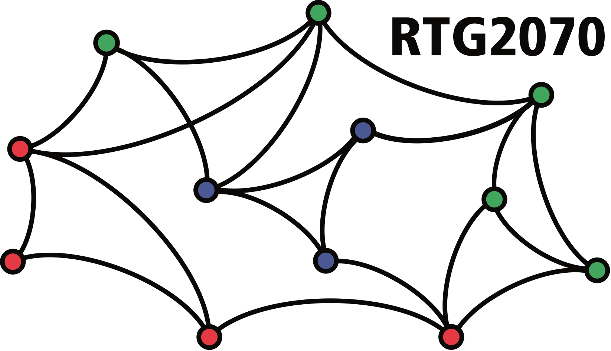

<!-- README.md is generated from README.Rmd. Please edit README.Rmd and run devtools::build_readme() -->
# EloRating.Bayes

## Installation

You need [`cmdstanr`](https://mc-stan.org/cmdstanr/) in order to install and run `EloRating.Bayes`. 
This in turn requires a working C++ toolchain first. 
Check out the [getting started-guide](https://mc-stan.org/cmdstanr/articles/cmdstanr.html) from `cmdstanr` to see how to get everything set up properly. 
Also [this document](https://mc-stan.org/docs/cmdstan-guide/cmdstan-installation.html#cpp-toolchain) might be helpful.

Then install `cmdstanr`.

```{r, eval = FALSE}
install.packages("cmdstanr", repos = c("https://mc-stan.org/r-packages/", getOption("repos")))
```

And you also need the `remotes` packages, which is easy to install from CRAN:

```{r, eval = FALSE}
install.packages("remotes")
```


Then check whether things are set up correctly:

```{r, eval = FALSE}
library(cmdstanr)
check_cmdstan_toolchain(fix = TRUE)
```

If this gives positive feedback, install `EloRating.Bayes`:

```{r, eval = FALSE}
library(remotes)
remotes::install_github("gobbios/EloRating.Bayes", dependencies = TRUE, build_vignettes = FALSE)
```


If you want to install (recompile) the intro vignette, use:

```{r, eval = FALSE}
library(remotes)
remotes::install_github("gobbios/EloRating.Bayes", dependencies = TRUE, build_vignettes = TRUE)
```


## Examples

```{r, include=FALSE}
library(EloRating.Bayes)
```


```{r, eval=FALSE}
# create a toy data set
set.seed(123)
x <- EloRating::randomsequence(nID = 6, avgIA = 10, presence = c(0.4, 0.4))
winner <- x$seqdat$winner
loser <- x$seqdat$loser
Date <- x$seqdat$Date
presence <- x$pres
intensity <- sample(c("mild", "severe"), length(winner), TRUE)

# prep data
standat <- prep_seq(winner = winner, loser = loser, Date = Date, presence = presence, intensity = intensity)

# fit 
res <- elo_seq_bayes(standat = standat, quiet = FALSE, parallel_chains = 4, seed = 1)
```

A numeric summary.

```{r, eval=TRUE, echo=2:2}
res <- toydata()
summary(res)
```

Example of posterior predictive check: proportion of won interactions per individual.

```{r, eval=FALSE}
pp_check(res, n_samples = 50)
```

```{r pp_plot_ex01, echo=FALSE, fig.width=7, fig.height=2.7, out.width="70%"}
par(family = "serif", mgp = c(1.5, 0.4, 0), tcl = 0.2, mar = c(2.5, 2.5, 1.5, 0.5))
set.seed(1)
pp_check(res, n_samples = 50)
```

Plot posteriors of ratings. By default this is on the last day of data set (here one individual is absent that day, *o*, and hence missing from the plot).

```{r, eval=FALSE}
plot_scores(res)
```

```{r scores_01, echo=FALSE, fig.width=7, fig.height=2.7, out.width="70%"}
par(family = "serif", mgp = c(1.2, 0.4, 0), tcl = 0.2, mar = c(2.9, 2.5, 1.5, 0.5))
set.seed(1)
plot_scores(res)
```

## Estimating spread of start ratings

Recently, I've put back the possibility to estimate the spread of start ratings. 
Alongside this option I created a first version of a function for simulating interaction outcomes that actually starts with creating start ratings.
Incidentally, this function has an argument to set the spread of the start ratings.

So here, let's simulate data with known spread of start ratings and then compare two models, one of which actually estimates the spread (in fact we are talking about the SD of the start ratings) and the other does not.


```{r estimate_sds, include=TRUE, echo=TRUE}
set.seed(123)
x <- principled_interactions(n_ind = 12, n_int = 100, startspread = 3)

# model 1: estimate with spread
d1 <- prep_seq(winner = x$idata$winner, loser = x$idata$loser, 
               Date = x$idata$date, estimate_startspread = TRUE)
res1 <- elo_seq_bayes(d1, parallel_chains = 4, seed = 27, quiet = TRUE)
summary1 <- extract_elo_b(res1, targetdate = 0)

# model 2: estimate without spread
d2 <- prep_seq(winner = x$idata$winner, loser = x$idata$loser,
               Date = x$idata$date, estimate_startspread = FALSE)
res2 <- elo_seq_bayes(d2, parallel_chains = 4, seed = 47, quiet = TRUE)
summary2 <- extract_elo_b(res2, targetdate = 0)
```

```{r estimate_sds_plot, echo=FALSE, echo=2:20, fig.width=8, fig.height=2.6, out.width="70%"}
par(mfrow = c(1, 2), family = "serif", mgp = c(1.5, 0.4, 0), tcl = 0.2, mar = c(2.5, 2.5, 1.5, 0.5))

plot(x$startratings[summary1$id], summary1$median, asp = 1,
     xlab = "true start ratings", ylab = "estimated start ratings")
abline(0, 1, lty = 2)
mtext("estimated SD", line = -1)

plot(x$startratings[summary2$id], summary2$median, asp = 1,
     xlab = "true start ratings", ylab = "estimated start ratings")
abline(0, 1, lty = 2)
mtext("fixed SD", line = -1)
```


In both models there a close correlation between true and estimated start ratings. 
In the model that estimates the start rating SD though, the recovered start values align with the true values fairly well in an absolute sense.
The model that assumes a fixed SD for the start ratings doesn't recover the true start ratings in an absolute sense.
So that looks like a good start. 
TBC.


## Acknowledgments

This work was supported by Deutsche Forschungsgemeinschaft, Grant/Award Number: 254142454 / GRK 2070.

```{r, echo=FALSE, out.width="50%", fig.align='center'}

```
