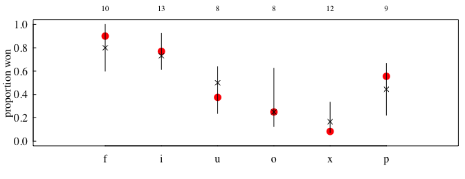
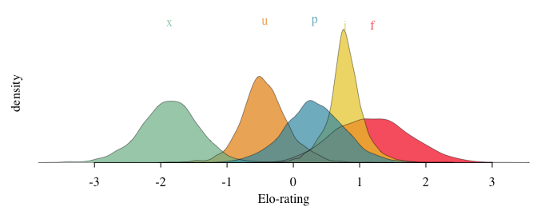
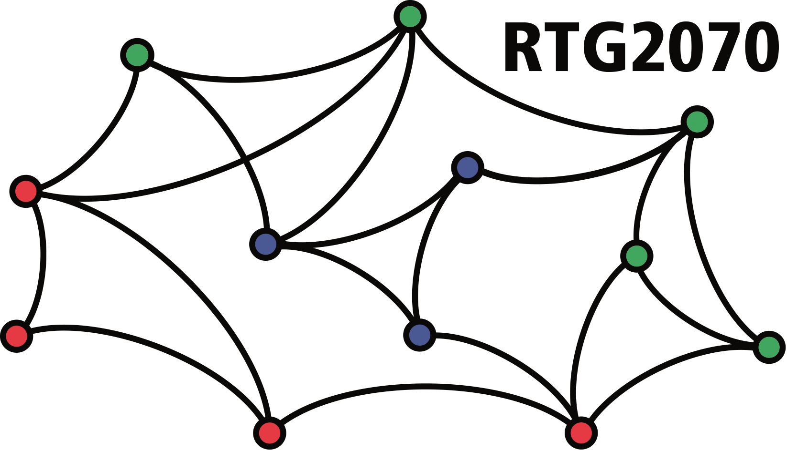

<!-- README.md is generated from README.Rmd. Please edit README.Rmd and run devtools::build_readme() -->

# EloRating.Bayes

## Installation

You need [`cmdstanr`](https://mc-stan.org/cmdstanr/) in order to install
and run `EloRating.Bayes`. This in turn requires a working C++ toolchain
first. Check out the [getting
started-guide](https://mc-stan.org/cmdstanr/articles/cmdstanr.html) from
`cmdstanr` to see how to get everything set up properly. Also [this
document](https://mc-stan.org/docs/cmdstan-guide/cmdstan-installation.html#cpp-toolchain)
might be helpful.

Then install `cmdstanr`.

``` r
install.packages("cmdstanr", repos = c("https://mc-stan.org/r-packages/", getOption("repos")))
```

And you also need the `remotes` packages, which is easy to install from
CRAN:

``` r
install.packages("remotes")
```

Then check whether things are set up correctly:

``` r
library(cmdstanr)
check_cmdstan_toolchain(fix = TRUE)
```

If this gives positive feedback, install `EloRating.Bayes`:

``` r
library(remotes)
remotes::install_github("gobbios/EloRating.Bayes", dependencies = TRUE, build_vignettes = FALSE)
```

If you want to install (recompile) the intro vignette, use:

``` r
library(remotes)
remotes::install_github("gobbios/EloRating.Bayes", dependencies = TRUE, build_vignettes = TRUE)
```

## Examples

``` r
# create a toy data set
set.seed(123)
x <- EloRating::randomsequence(nID = 6, avgIA = 10, presence = c(0.4, 0.4))
winner <- x$seqdat$winner
loser <- x$seqdat$loser
Date <- x$seqdat$Date
presence <- x$pres
intensity <- sample(c("mild", "severe"), length(winner), TRUE)

# prep data
standat <- prep_seq(winner = winner, loser = loser, Date = Date, presence = presence, intensity = intensity)

# fit 
res <- elo_seq_bayes(standat = standat, quiet = FALSE, parallel_chains = 4, seed = 1)
```

A numeric summary.

``` r
summary(res)
```

    ## Bayesian Elo ratings from 6 individuals
    ## total (mean/median) number of interactions: 30 (10.0/9.5)
    ## range of interactions: 8 - 13 
    ## date range: 2000-01-01 - 2000-01-30 
    ## median k (89% CI): 
    ##   - severe: 0.302 (0.025 - 1.045)
    ##   - mild: 0.405 (0.039 - 1.302)
    ## proportion of draws in the data set: 0.00 
    ## number of post-warmup samples: 4000 
    ## no obvious sampling issues detected

Example of posterior predictive check: proportion of won interactions
per individual.

``` r
pp_check(res, n_samples = 50)
```



Plot posteriors of ratings. By default this is on the last day of data
set (here one individual is absent that day, *o*, and hence missing from
the plot).

``` r
plot_scores(res)
```



## Acknowledgments

This project was funded by the German Research Foundation via an RTG
grant:


